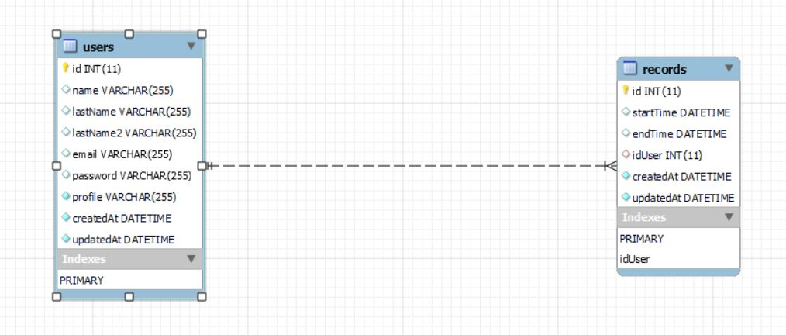

<h1>Backend timeRecord</h1>

:speech_balloon: [About](#id1)   

:hammer: [Tools](#id2)

:eye_speech_bubble: [Backend](#id3)

---

## **About**

Backend correspondiente a una prueba técnica de Bounsel.

Agregar la funcionalidad nueva a una aplicación para que registre el tiempo de conexión de un usuario, desde el login hasta el logout o el cierre del browser.

Condiciones:

* Solo una llamada a la API para obtener los registros.
* Los registros de un usuario se deben buscar entre dos fechas.
* Se deben ver los registros en el Frontend.

---
**Start date:** 06 / 08 /2021
**Deadline:** 08 / 08 / 2021

**Contributors:**
* [Mariana Fernández Sacristán](https://github.com/mlfernandez)

---

## **Tools**

Se utilizaron las siguientes tecnologías:

|  | Visual Studio Code |

|  | JavaScript | 

|  | NODE JS & EXPRESS |

|  | AXIOS | 

|  | Git |

|  | GitHub | 

|  | Postman |

## **Backend**

Se definieron los siguientes modelos:

Se establecieron que serían necesarios los siguientes modelos:

**Modelo user:**
Los atributos fueron definidos pensando en los datos que necesita un sistema bancario. 

* name // string, // Nombre del usuario
* lastName / lastName2 // string //  Apellidos del usuario
* email // string // email del usuario, verifica que sea único, si se hace el registro..
* password // string // a modo de dato dummy se utiliza uno que no cumple los requisitos de seguridad.
* profile // string // "admin" o "user"

**Modelo record:** 

* stratTime // date // fecha de comienzo de registro
* endTime // date // fecha de fin de registro
* user_id // integer // id del usuario

**Colección em Postman:**

[Ver documentación de Postman](https://documenter.getpostman.com/view/15824691/TzskENcX)